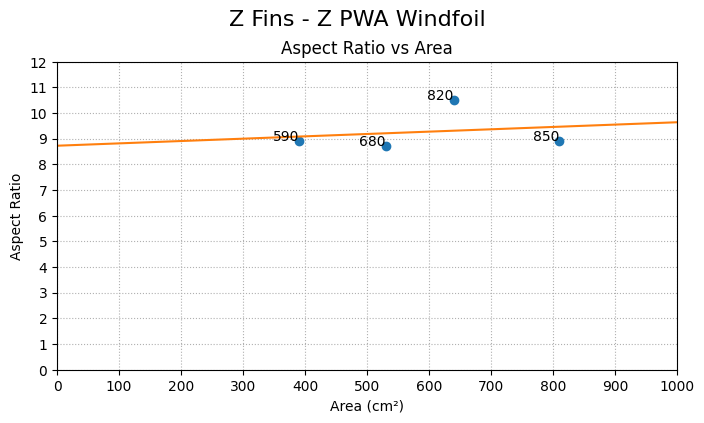

## Z Fins Z PWA Windfoil

| Name | Span (mm) | Area (cm²) | Aspect Ratio |
| ---- | :-------: | :--------: | :----------: |
| 850 | 850 | 810 | 8.9 |
| 820 | 820 | 640 | 10.5 |
| 680 | 680 | 530 | 8.7 |
| 590 | 590 | 390 | 8.9 |

.png)

.png)

